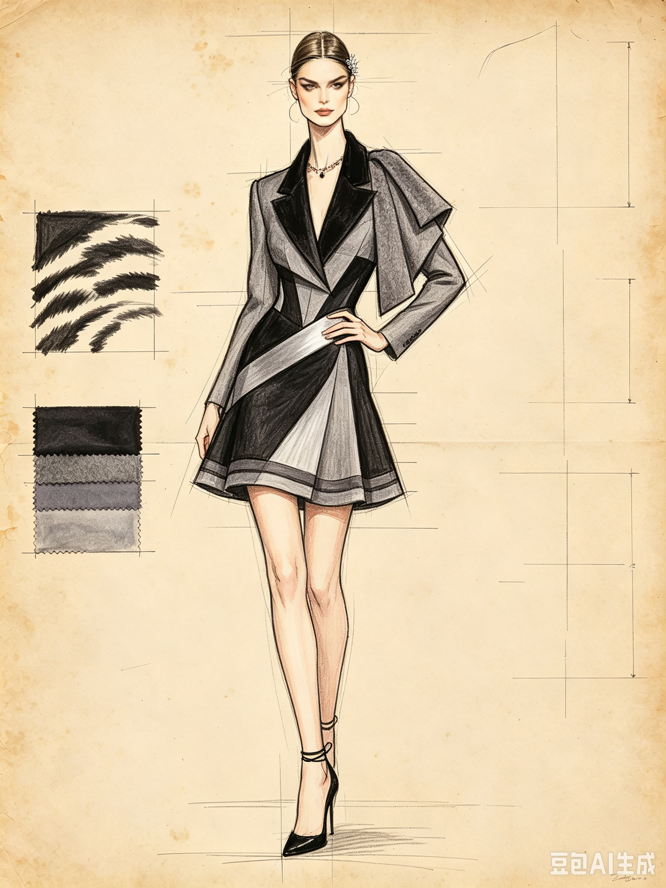
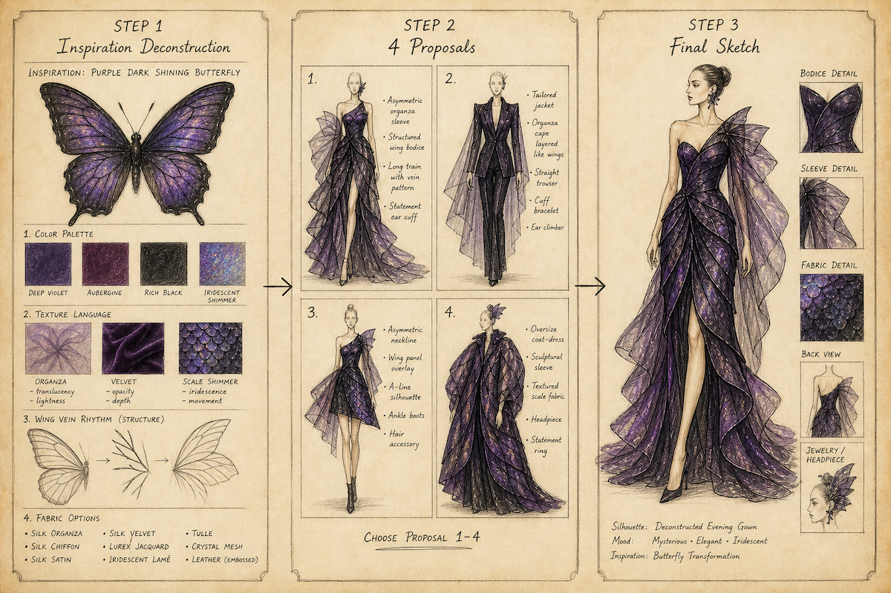
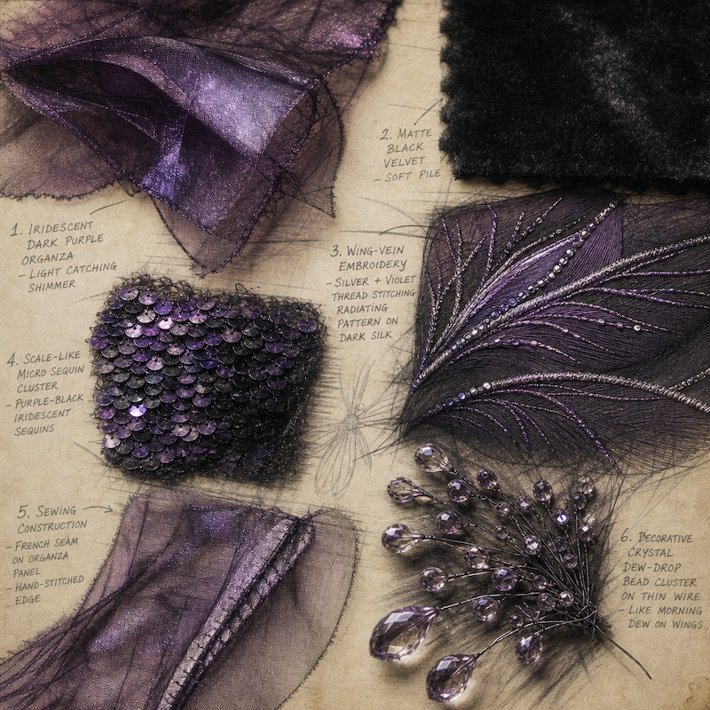

# couture‑sketch‑designer‑skill
AI Skill for high‑fashion hand‑drawn couture sketch generation (V2).

Transform any source‑object into abstract fashion designs. Output designer‑style pencil‑colored sketch text descriptions, ready for text‑to‑image models (Midjourney / Stable Diffusion).

*Example render: final couture sketch output. Vintage yellowed paper, natural pencil strokes, reference call‑out panels arranged around the central model.*

## Key Features
1. **Open silhouette freedom**: Not limited to fitted evening gowns. Supports tailored suits, mini‑skirts, deconstructed shapes, casual‑luxury and experimental eye‑catching silhouettes.
2. **No cheap literal copying**: Forbid printing animal faces, gluing real‑world appendages onto clothing. Extract color blocking, texture, rhythm and material contrast as abstract fashion design language.
3. **Mandatory design variables**: Every proposal explicitly defines: sleeves, shawls, jewelry embellishments, headpieces.
4. **Strict margin panel rules**:
    - Only two categories are allowed for surrounding sketch panels:
      ① Minimal pencil sketch of the original inspiration object (source reference).
      ② Construction details **actually implemented on the garment**: fabric swatches, pattern pieces, stitching lines, decorative buttons, embroidery samples, accessory components.
    - Unused drafts, abandoned structures, irrelevant decorative elements must not appear.
5. **Consistent hand‑drawn aesthetic**: Pencil + colored‑pencil texture, faint unfinished proportion construction lines, subtle yellowed vintage paper background.
6. **Design references**: Alexander McQueen experimental construction, Dior haute couture hand‑atelier craftsmanship. Optional subtle tech‑infused material treatment (no garish cyber‑neon effects).

## 📁 Repository Structure

## 🎯 Real‑World Use Cases
- **Independent fashion designers**: Rapidly explore abstract inspiration‑driven garment concepts before physical pattern‑making.
- **AI fashion prompt engineers**: Generate high‑quality structured text prompts for image generation pipelines.
- **Fashion education & student practice**: Learn how to abstract natural reference sources instead of literal surface copying.
- **Concept art / costume design**: Create experimental outfit sketches for film, game and character projects.
- **Personal creative exploration**: Turn everyday objects into unique wearable clothing ideas.

## 🚀 Quick Start
Copy the full content of `skill_definition_v2.md` and set it as your LLM system prompt.

### Input examples
raccoon
obsidian rose
random

### Three‑step workflow
1. **Step 1 — Inspiration Deconstruction**
Extract source‑object’s color palette, texture, block‑and‑shape rhythm. Translate into abstract fashion‑design language. Output fabric options, craft directions, candidate silhouettes and accessory possibilities.

2. **Step 2 — Generate 4 distinct proposals**
Each proposal includes: model description, base pose, silhouette, sleeves / shawl / jewelry / headpiece settings and garment construction notes.
The LLM will prompt you: `Please choose: Proposal1 / Proposal2 / Proposal3 / Proposal4`

3. **Step 3 — Generate final full‑sketch textual description**
Model placed center‑frame with natural runway‑style pose. Margin panels contain only inspiration‑source sketch plus garment‑used construction details. No unused or hypothetical design elements are allowed.

*Close‑up view: margin panels contain only source‑object sketch and real garment‑construction details that appear on the finished piece.*

## 🤖 Recommended LLM Back‑ends
This skill depends heavily on **strict system‑prompt adherence**, long‑context handling and structured output quality. Different LLMs produce noticeably different results.

### ✅ Best Performing (Closed‑source API)
1. **Claude 3.7 Opus / Sonnet**
- Pros: Best overall compliance with complex multi‑rule system prompts, large context window, strong abstract fashion reasoning, reliably avoids literal cheap copying (e.g. gluing animal tails onto clothes). Sonnet gives excellent cost‑performance for regular testing.
- Cons: Higher token cost for heavy usage.
- Recommendation: **Primary choice for this skill**.

2. **GPT‑5.4 Pro**
- Pros: Solid instruction‑following, good text‑to‑image prompt construction.
- Cons: Sometimes ignores marginal‑panel constraints; may revert to literal motif printing without extra reminders.

3. **Gemini 3.1 Pro**
- Pros: Balanced speed‑cost, large context.
- Cons: Occasional rule‑dropping on long system prompts.

### ✅ Open‑Weight / Self‑host options
Good for offline‑only, privacy‑first usage. Expect more manual prompt tuning.
1. **DeepSeek‑V3.2‑Instruct / DeepSeek‑R1**
- Pros: Top‑tier open‑source instruction‑following score, respects multi‑constraint rules, good structured text generation.
- Hardware: Minimum 32 GB VRAM for 70B quantized GGUF.

2. **Qwen‑3.5‑235B‑Instruct**
- Pros: Strong format discipline, stable output structure, friendly license.
- Hardware: 40 GB+ VRAM recommended.

3. **Llama 4 Maverick**
- Pros: General‑purpose strong reasoning, widely supported hosting options.
- Cons: More likely to break strict margin‑panel rules, requires example few‑shot samples for best results.

### ⚠️ Known weaker candidates (not recommended)
Small‑parameter models (7B‑14B general‑purpose chat models): frequently drop constraints, ignore “no‑literal‑copy” rules, hallucinate unrelated sketch‑panel elements.

### 💡 Practical Tips for better results
1. Assign the full content of `skill_definition_v2.md` as **system prompt**, not as user‑message.
2. Keep one chat session dedicated to this skill; avoid mixing unrelated conversation history.
3. If you observe bad outputs (literal animal motifs, invalid margin‑panel items): restart chat session, or append reminder:
> Strictly follow all hard constraints in your system prompt, do not add garment‑elements that are not defined.
4. Open‑source models benefit from adding the `example_raccoon.md` as few‑shot demonstration.

## Input & Output
- **Input**: A physical‑object name or keyword / `random` flag / optional `add subtle tech‑infused details` modifier
- **Output**: Structured text‑description of a fashion sketch, ready to feed into Midjourney / Stable Diffusion / other image‑generation services.

## 📌 Hard Constraints built‑into skill
1. Do not generate likeness of real‑world celebrities; use generic high‑fashion runway‑model aesthetic only.
2. All margin reference panels must strictly correspond to elements present on the finished garment. No irrelevant graphics.
3. Every design must respect real‑world fabric properties, sewing logic and garment‑construction feasibility.
4. Optional tech‑infused details must be embedded inside fabric, lining or embroidery layers; avoid loud neon cyber‑punk aesthetics.

## Example Run
See `example_raccoon.md` for a complete end‑to‑end example using “raccoon” as the inspiration source object.

## Known Limitations
- This repository provides only **text‑based skill prompt**, it does not contain image‑generation weights or models.
- Visual outputs depend on your downstream image‑generation tool’s capability to interpret long text prompts.
- GIF / animated preview is not included in repo by default; you can generate animated render from step‑3 output prompt.

## Contributing
Contributions are welcome:
- Test this skill with different inspiration objects.
- Report LLM output bugs where irrelevant elements appear in margin panels.
- Submit pull requests for improved prompt wording, new sample outputs or documentation improvements.

When reporting issues, please attach your input prompt and the full LLM output for reproduction.

## Acknowledgements
Thank you for testing, experimenting and giving feedback on this open‑source fashion‑design skill. All kinds of suggestions, use‑case ideas and real‑world test results are highly appreciated.

## License
MIT
